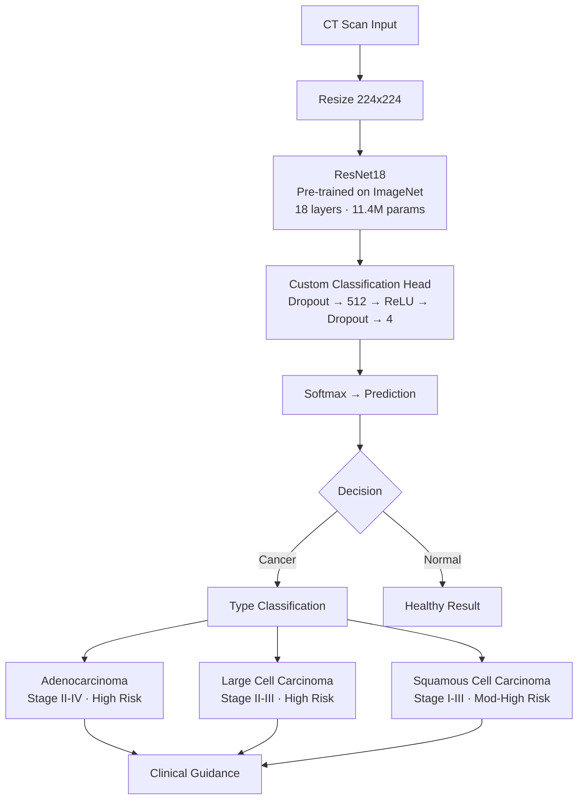

# 🫁 Lung Cancer Detection & Classification AI

[](https://python.org)
[](https://pytorch.org)
[](https://pytorch.org/hub/pytorch_vision_resnet/)
[](https://streamlit.io)
[](https://huggingface.co/datasets/Mahadih534/Chest_CT-Scan_images-Dataset)

Deep learning system for **lung cancer detection** and **classification** from chest CT scans using transfer learning with ResNet18.

---

## 🎯 What It Does

| Feature | Method | Output |
|---------|--------|--------|
| **Cancer Detection** | ResNet18 CNN | Cancer / Normal |
| **Cancer Classification** | 4-class softmax | Adenocarcinoma / Large Cell Carcinoma / Squamous Cell Carcinoma / Normal |
| **Cancer Staging** | Clinical mapping | Stage I-IV based on type |
| **Clinical Guidance** | Rule-based | Treatment recommendations |

---

## 🏗 Architecture



---

## 📊 Results

| Metric | Score |
|--------|-------|
| **Test Accuracy** | **65.71%** |
| **Normal Detection** | 98.15% |
| **Squamous Cell Detection** | 94.44% |

### Per-Class Performance

| Class | Samples | Accuracy | Stage | Risk |
|-------|:-------:|:--------:|:-----:|:----:|
| **Normal** | 54 | 98.15% | N/A | None |
| **Squamous Cell Carcinoma** | 90 | 94.44% | I-III | Moderate-High |
| **Adenocarcinoma** | 120 | 41.67% | II-IV | High |
| **Large Cell Carcinoma** | 51 | 37.25% | II-III | High |

> **Note:** Adenocarcinoma and large cell carcinoma are subtypes of non-small cell lung cancer (NSCLC) and share similar visual features in CT scans, explaining the lower per-class accuracy. Performance can be improved with more training epochs or a deeper architecture (ResNet50).

---

## 🛠 Tech Stack

| Layer | Technology | Purpose |
|-------|-----------|---------|
| **Framework** | PyTorch 2.0+ | Deep learning engine |
| **Architecture** | ResNet18 (ImageNet pre-trained) | Transfer learning backbone |
| **Augmentation** | Random flip, rotation, color jitter | Generalization |
| **Optimizer** | AdamW + ReduceLROnPlateau | Training |
| **UI** | Streamlit + Plotly | Interactive dashboard |
| **Data** | IQ-OTH/NCCD Lung Cancer Dataset | 999 CT scan images |

---

## 📁 Project Structure

```
lung-cancer-detection/
├── app.py                          # Streamlit dashboard
├── src/
│   └── lung_cancer_pipeline.py      # Training + evaluation pipeline
├── data/
│   ├── train/                      # 684 CT images (4 classes)
│   │   ├── adenocarcinoma/
│   │   ├── large_cell_carcinoma/
│   │   ├── normal/
│   │   └── squamous_cell_carcinoma/
│   └── test/                       # 315 CT images (4 classes)
├── models/
│   └── best_model.pth              # Trained ResNet18 weights
├── results/
│   ├── confusion_matrix.png        # Classification heatmap
│   ├── training_history.png        # Loss + accuracy curves
│   └── results.json                # Full metrics
├── download_data.py
├── requirements.txt
└── README.md
```

---

## 🚀 How to Run

```bash
# 1. Install
pip install torch torchvision streamlit plotly pandas pillow requests datasets

# 2. Download dataset
python download_data.py

# 3. Train the model
python src/lung_cancer_pipeline.py

# 4. Launch interactive dashboard
streamlit run app.py
```

---

## 🖥 Dashboard Features

- **Upload CT Scan** — Drag & drop image analysis
- **Instant Diagnosis** — Cancer type + confidence score
- **Cancer Staging** — Clinical stage based on classification
- **Clinical Guidance** — Treatment recommendations by cancer type
- **Probability Chart** — Class-wise prediction breakdown

---

## 📚 Dataset

The [IQ-OTH/NCCD Lung Cancer Dataset](https://huggingface.co/datasets/Mahadih534/Chest_CT-Scan_images-Dataset) contains 999 CT scan images from the Iraq-Oncology Teaching Hospital/National Center for Cancer Diseases. Images were collected from patients across multiple stages and classified by oncologists.

---

<p align="center">
<b>Built by Basit Ali</b> · <a href="https://github.com/basitali08">GitHub</a> · <a href="mailto:whoisbasit@gmail.com">Email</a><br>
<sub>Deep Learning for Medical Imaging · MS Data Science Portfolio</sub>
</p>
